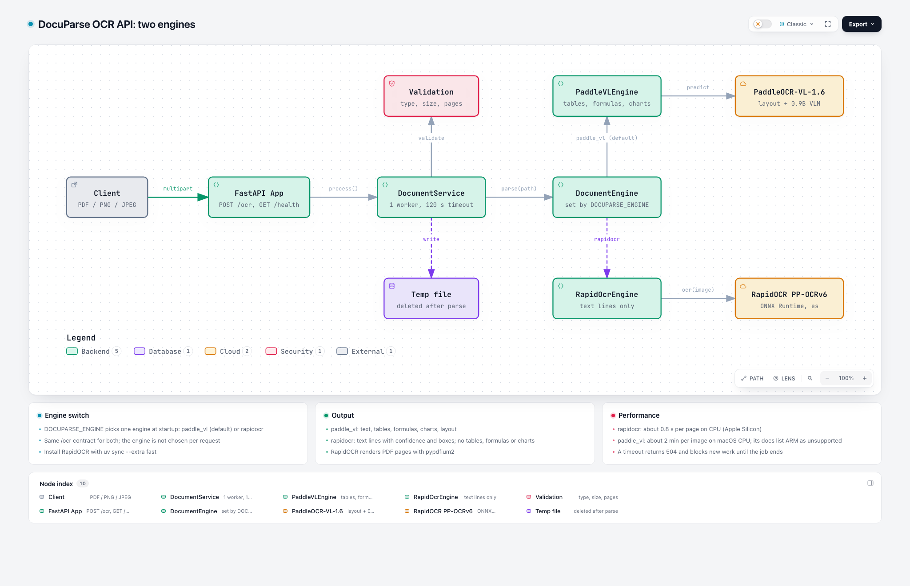

# DocuParse

Lightweight Document Intelligence REST API for Spanish business documents. It receives a PDF, PNG or
JPEG and returns structured JSON. Two interchangeable engines are available: PaddleOCR-VL-1.6
(text, tables, formulas, charts, layout) and RapidOCR (fast CPU, text only). See [Engines](#engines).

## Architecture



## Run

```bash
uv sync
uv run uvicorn docuparse.main:app --port 8000
```

The first start downloads the model. Wait until `GET /health` returns `healthy`.

To run the fast CPU engine instead (or on a second port at the same time):

```bash
DOCUPARSE_ENGINE=rapidocr uv run --extra fast uvicorn docuparse.main:app --port 8001
```

## Use

```bash
curl localhost:8000/health
curl -F file=@tests/samples/factura.png localhost:8000/ocr
```

Limits: 10 MB per file, 20 pages per PDF, 120 s per request. The API contract is in
`specs/001-document-ocr-api/contracts/openapi.yaml`.

## Engines

The engine is chosen at startup with `DOCUPARSE_ENGINE`, not per request. The `/ocr` contract is the same.

| | `paddle_vl` (default) | `rapidocr` |
|---|---|---|
| Model | PaddleOCR-VL-1.6 | PP-OCRv6 via ONNX Runtime (Spanish) |
| Output | text, tables, formulas, charts, layout | text lines with confidence and boxes |
| CPU speed | slow (about 2 min per image on macOS) | about 1 s per page (Apple Silicon, [results](docs/benchmark-results.md)) |
| Install | `uv sync` | `uv sync --extra fast` |

PaddleOCR-VL's docs list ARM CPUs as unsupported, so it may not run on Apple Silicon.

Compare them with `uv run python scripts/benchmark.py rapidocr paddle_vl [--truth DIR]`, where `DIR`
holds one `<sample file name>.txt` of ground truth per sample.

The interactive diagram is in `.archify/architecture-docuparse-engines-*/docuparse.html`.
The Postman collection has one folder per engine (ports 8000 and 8001).

## Tests

```bash
uv run pytest                           # fake engine
DOCUPARSE_E2E=1 uv run pytest -k e2e    # real engine (slow on CPU)
```

Synthetic Spanish samples are generated by `tests/samples/make_samples.py`.
